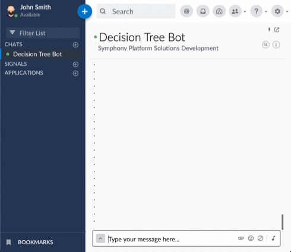

## Decision Tree Bot

This bot reads off a CSV file to fire a series of wizard-style questions.
Every row in the csv file represents a complete permutation of a possible path,
where the column header contains the question and the column values contain the possible options.
If a permutation needs to skip a question, the value can be specified as 'N/A'.

The bot can also forward custom enquiries to an admin room if one is provided in the config file.



## Requirements
* JDK 8
* Maven 3

## Example Data CSV
| Where are you going? | When is it? | Are you doing this? | Result                |
|----------------------|-------------|---------------------|-----------------------|
| Somewhere            | Today       | Yes                 | Answer A              |
| Somewhere            | Today       | No                  | Maybe                 |
| Somewhere            | Tomorrow    | Yes                 | Absolutely            |
| Somewhere            | Tomorrow    | No                  | Subject to approval   |
| Nowhere              | Today       | N/A                 | Not permitted         |
| Nowhere              | Tomorrow    | N/A                 | Here are some caveats |

# Configuration
Fill up `src/main/resources/config.json` with the appropriate values for pod information,
service account details, data file location and the name of the compliance team room. 
```json5
{
    "sessionAuthHost": "[pod].symphony.com",
    "sessionAuthPort": 443,
    "keyAuthHost": "[pod].symphony.com",
    "keyAuthPort": 443,
    "podHost": "[pod].symphony.com",
    "podPort": 443,
    "agentHost": "[pod].symphony.com",
    "agentPort": 443,
    "truststorePath": "internal_truststore",
    "truststorePassword": "changeit",
    "botUsername": "decision-tree-bot",
    "botEmailAddress": "decision-tree-bot@bots.symphony.com",
    "botPrivateKeyPath": "rsa/",
    "botPrivateKeyName": "rsa-private-decision-tree-bot.pem",
    "dataFilePath": "/path/to/data.csv",
    "adminRoomName": "Admin Room"
}
```
